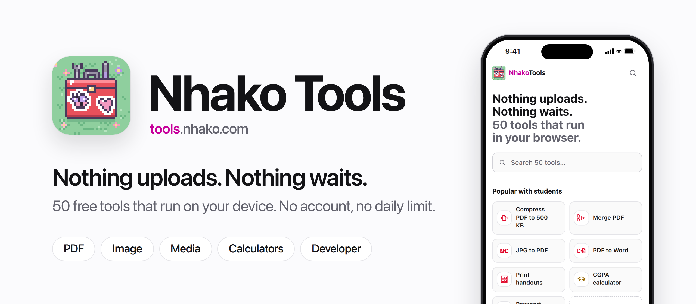
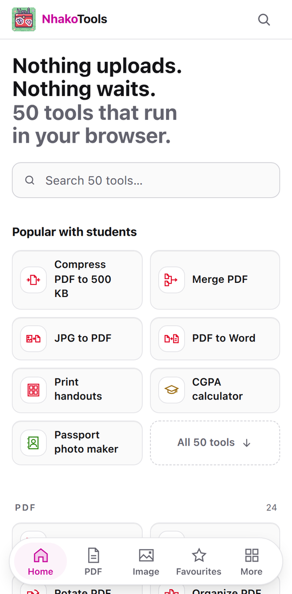
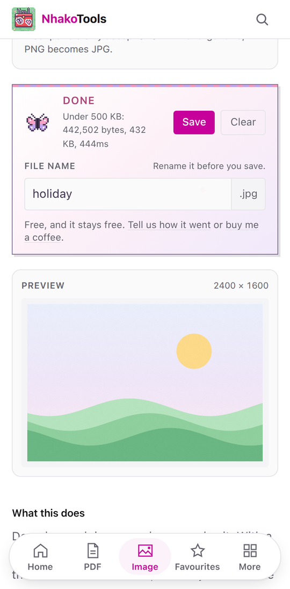
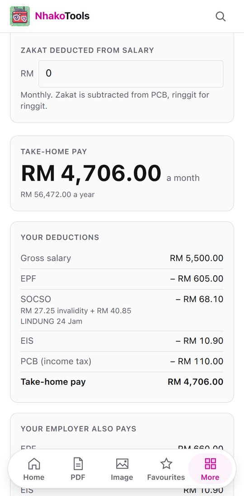
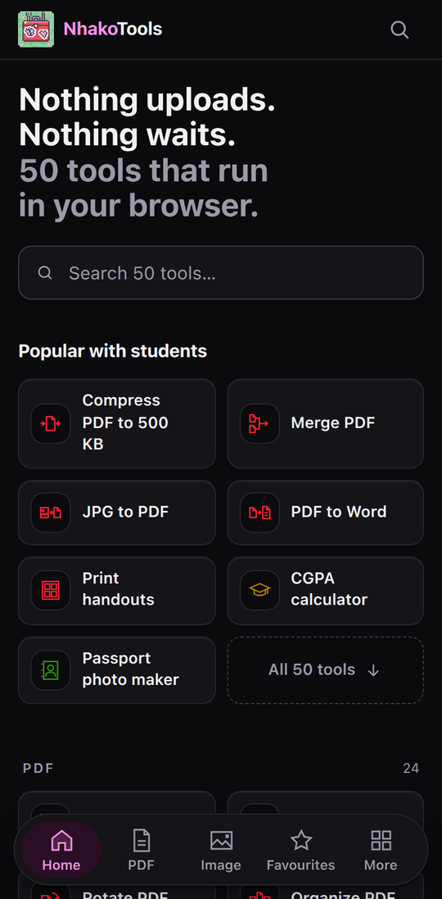
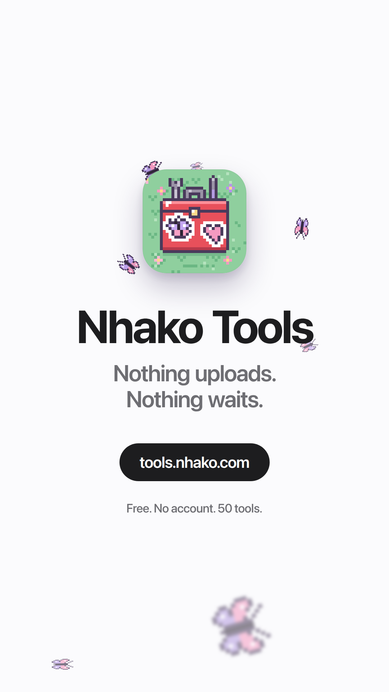

<p align="center">
  
</p>

<p align="center">
  <b>50 free tools for PDFs, images, media, calculators and code, that run on your device.</b><br>
  Nothing uploads. Nothing waits. No account, no daily limit, no watermark.
</p>

<p align="center">
  <a href="https://tools.nhako.com"><b>tools.nhako.com</b></a>
  &nbsp;|&nbsp;
  <a href="https://tools.nhako.com/ms">Bahasa Melayu</a>
  &nbsp;|&nbsp;
  <a href="launch/nhako-tools-launch.mp4">Launch video</a>
  &nbsp;|&nbsp;
  <a href="docs/pwa-and-android.md">PWA and Android plan</a>
  &nbsp;|&nbsp;
  <a href="https://tools.nhako.com/feedback">Feedback</a>
</p>

<p align="center">
  
  
  
  
  
  
</p>

---

## Contents

- [On a phone](#on-a-phone)
- [Why it exists](#why-it-exists)
- [What you get besides the tools](#what-you-get-besides-the-tools)
- [Tools](#tools)
- [Install it as an app](#install-it-as-an-app)
- [Launch video](#launch-video)
- [Honest limits](#honest-limits)
- [Privacy, precisely](#privacy-precisely)
- [Architecture](#architecture)
- [Local development](#local-development)
- [Design](#design)
- [Roadmap](#roadmap)
- [Feedback and support](#feedback-and-support)
- [Credits and licence](#credits-and-licence)

---

## On a phone

Real captures of the production build at iPhone size, taken by
`launch/video/capture.mjs`. Below 1024 px the site switches to an app shell: a
floating tab bar, a More sheet, and a back link instead of breadcrumbs.

<table>
  <tr>
    <td align="center"><br><sub>Home</sub></td>
    <td align="center"><br><sub>A 5.5 MB photo to 432 KB</sub></td>
    <td align="center"><br><sub>Malaysian take-home pay</sub></td>
    <td align="center"><br><sub>Dark mode</sub></td>
  </tr>
</table>

## Why it exists

Most online tools upload your file, process it on a server, and send it back. That
means an upload wait, a queue, a size cap, usually a daily limit, and often an
account before you can download the result.

None of that is necessary any more, because browsers can do this work directly. So there
is no upload step here. That makes the tools faster, and it happens to make them
private, because a file that is never sent anywhere cannot leak.

You do not have to take that on trust. Open your network tab and run any tool:
your file never appears in it.

## What you get besides the tools

| | |
|---|---|
| **Search everything** | `⌘K` or `Ctrl K` (or the search icon on a phone) finds any of the 50 tools and their size presets, in English or Malay ("gaji" finds the salary calculator) |
| **Favourites** | Star a tool and it waits on [/favourites](https://tools.nhako.com/favourites). Stored in this browser only; there is no account to sync it to |
| **Two languages** | Every page and tool in English and Bahasa Melayu, at `/` and `/ms` |
| **Malaysia page** | [/malaysia](https://tools.nhako.com/malaysia) gathers the jobs Malaysian forms ask for: SPA MyRésumé photo sizes, the salary calculator, passport photos, CGPA |
| **Size presets** | Pages like [Compress PDF to 500 KB](https://tools.nhako.com/pdf/compress/500kb) and [Compress image to 100 KB](https://tools.nhako.com/image/compress/100kb) open with the target already set |
| **Light and dark** | Light by default; dark from the toggle in the header, remembered per browser |
| **Installable** | An app on Android, iPhone, iPad, Mac, Windows and ChromeOS, with offline support ([below](#install-it-as-an-app)) |
| **NeraOS details** | Pixel butterflies drift behind the page; loading and finished states use the NeraOS boot bar, pops and petals. All of it stops under "reduce motion" |

## Tools

### PDF `/pdf/*`

| Tool | What it does |
|---|---|
| [Merge](https://tools.nhako.com/pdf/merge) | Combine several PDFs into one, losslessly |
| [Split](https://tools.nhako.com/pdf/split) | Extract pages or a page range into a ZIP |
| [Compress](https://tools.nhako.com/pdf/compress) | Lossless repacking, aggressive re-encoding, or under an exact size ([500 KB](https://tools.nhako.com/pdf/compress/500kb), 1 MB, ...) |
| [PDF to JPG](https://tools.nhako.com/pdf/to-image) | Render pages to JPG or PNG at up to 216 dpi |
| [PDF to text](https://tools.nhako.com/pdf/to-text) | Extract the embedded text layer |
| [Rotate](https://tools.nhako.com/pdf/rotate) | Fix orientation without re-rendering |
| [Watermark](https://tools.nhako.com/pdf/watermark) | Stamp text across every page |
| [JPG to PDF](https://tools.nhako.com/pdf/jpg-to-pdf) | One page per image; JPG and PNG embedded without recompression |
| [Organize](https://tools.nhako.com/pdf/organize) | Reorder, rotate and delete pages by thumbnail, across several files |
| [Sign](https://tools.nhako.com/pdf/sign) | Draw, type or upload a signature, place and resize it, add the date |
| [Page numbers](https://tools.nhako.com/pdf/page-numbers) | Six positions, four styles, skip the cover page |
| [Crop](https://tools.nhako.com/pdf/crop) | Trim margins by changing the crop box; nothing re-rendered |
| [Protect](https://tools.nhako.com/pdf/protect) | AES-256 password with optional print/copy/edit restrictions (qpdf) |
| [Unlock](https://tools.nhako.com/pdf/unlock) | Remove a password you know, and any restrictions (qpdf) |
| [PDF to Word](https://tools.nhako.com/pdf/to-word) | Rebuilds paragraphs, headings, bold and italic into a real .docx |
| [Office to PDF](https://tools.nhako.com/pdf/office-to-pdf) | [Word](https://tools.nhako.com/pdf/office-to-pdf/word), [Excel](https://tools.nhako.com/pdf/office-to-pdf/excel) and [PowerPoint](https://tools.nhako.com/pdf/office-to-pdf/powerpoint) to PDF with LibreOffice compiled to WebAssembly |
| [Scan to PDF](https://tools.nhako.com/pdf/scan) | Phone photos to a PDF: page found, straightened, shadows lifted |
| [OCR PDF](https://tools.nhako.com/pdf/ocr) | Makes a scanned PDF searchable in English and Malay, laying invisible text over the untouched pages |
| [Remove pages](https://tools.nhako.com/pdf/remove-pages) | Delete the pages you list, keep the rest in order, losslessly |
| [Extract pages](https://tools.nhako.com/pdf/extract-pages) | Copy the pages you list into a new PDF, in the order typed |
| [PDF to PowerPoint](https://tools.nhako.com/pdf/to-powerpoint) | One slide per page: the page's graphics as the picture, its text back on top in editable boxes |
| [Print handouts](https://tools.nhako.com/pdf/n-up) | 2, 4, 6, 8, 9 or 16 pages per A4 or Letter sheet, upright even for sideways pages |
| [Grayscale PDF](https://tools.nhako.com/pdf/grayscale) | Black and white for cheaper printing, at 150 or 300 dpi, chosen pages only |
| [Repair PDF](https://tools.nhako.com/pdf/repair) | Rebuilds a broken cross-reference with qpdf, falls back to an object-by-object rebuild, and checks the result opens |

### Media `/media/*`

| Tool | What it does |
|---|---|
| [Compress video](https://tools.nhako.com/media/compress-video) | Encode to a target file size via ffmpeg.wasm |
| [Extract audio](https://tools.nhako.com/media/extract-audio) | Pull the audio track out as MP3 |
| [Audio to text](https://tools.nhako.com/media/transcribe) | Whisper on your device, in English, Malay or other languages |
| [Teleprompter](https://tools.nhako.com/media/teleprompter) | Tablet-first prompter: words-per-minute speed, `[PAUSE]` cues, sections, mirror, pedal and page-turner keys, a phone remote, opt-in voice-follow, and camera + mic recording saved on the device |

### Image `/image/*`

| Tool | What it does |
|---|---|
| [Compress](https://tools.nhako.com/image/compress) | Re-encode at a chosen quality, or under an exact size ([100 KB](https://tools.nhako.com/image/compress/100kb), [SPA MyRésumé](https://tools.nhako.com/image/compress/spa-myresume), ...) |
| [Convert](https://tools.nhako.com/image/convert) | Move between JPG, PNG, WebP and AVIF |
| [Resize](https://tools.nhako.com/image/resize) | Scale to exact dimensions, aspect ratio preserved |
| [Crop](https://tools.nhako.com/image/crop) | Drag a frame or type exact pixels; ratios from 1:1 to 16:9 |
| [Rotate](https://tools.nhako.com/image/rotate) | Turn 90° or 180°, or flip, in batches |
| [Watermark](https://tools.nhako.com/image/watermark) | Tiled, centred or corner text with its own opacity |
| [HEIC to JPG](https://tools.nhako.com/image/heic-to-jpg) | iPhone photos to JPG or PNG (libheif where the browser cannot decode HEIC) |
| [Remove metadata](https://tools.nhako.com/image/remove-metadata) | Strips EXIF/XMP/IPTC including GPS, without touching a pixel |
| [Image to text](https://tools.nhako.com/image/ocr) | OCR in English and Malay; text or a searchable PDF |
| [Remove background](https://tools.nhako.com/image/remove-background) | Transparent PNG or a white backdrop, with an objects model and a people model |
| [Passport photo](https://tools.nhako.com/image/passport-photo) | 35×50 mm, white background on device, 600 dpi file plus a 4R print sheet |

### Calculators `/calc/*`

| Tool | What it does |
|---|---|
| [Salary (Malaysia)](https://tools.nhako.com/calc/take-home-pay) | Take-home pay after EPF, SOCSO (with LINDUNG 24 Jam), EIS and PCB, from the official 2026 tables |
| [CGPA calculator](https://tools.nhako.com/calc/cgpa) | Semester GPA, CGPA and the GPA needed for a target, on Universiti Malaya's published 4.00 scale, editable per university |

### Developer `/dev/*`

| Tool | What it does |
|---|---|
| [JSON](https://tools.nhako.com/dev/json) | Format, validate, sort and minify, with syntax highlighting |
| [JWT](https://tools.nhako.com/dev/jwt) | Decode header and payload; timestamps rendered as dates |
| [Base64](https://tools.nhako.com/dev/base64) | Encode and decode, full UTF-8, URL-safe alphabet |
| [Word count](https://tools.nhako.com/dev/word-count) | Live word, character, sentence and reading-time counts |
| [Hash](https://tools.nhako.com/dev/hash) | SHA-1/256/384/512 via Web Crypto |
| [UUID](https://tools.nhako.com/dev/uuid) | Bulk v4 UUIDs from the platform CSPRNG |
| [QR code](https://tools.nhako.com/dev/qr) | Encodes your text directly, with no tracking redirect |
| [Text diff](https://tools.nhako.com/dev/diff) | Compare by line, word or character |
| [CSS shadow](https://tools.nhako.com/dev/css-shadow) | Build `box-shadow` with a live preview |

## Install it as an app

Nhako Tools is a Progressive Web App: a web app manifest
(`public/manifest.webmanifest`), a service worker (`scripts/build-sw.mjs`), and
maskable icons drawn for Android's adaptive mask. The site offers to install
itself on your second page view (or after 20 seconds), with the right steps for
each browser, and never nags: "Not now" snoozes it for 14 days. Inside the
installed app it never asks.

| Device | How |
|---|---|
| Android (Chrome, Edge) | Tap **Install** on the card, or the browser menu's **Install app**. Chrome turns it into a WebAPK, a real Android app in the launcher and Settings > Apps |
| iPhone and iPad (Safari) | **Share**, then **Add to Home Screen**, then **Add**. The card shows these steps |
| Mac (Safari 17+) | **File > Add to Dock** |
| Windows, Mac, Linux, ChromeOS (Chrome, Edge) | The install icon in the address bar |

**Offline.** After one visit the home page works offline, and any tool works
offline once you have opened it once (the engines it downloaded stay cached).
Big runtimes (ffmpeg, the ONNX runtime, LibreOffice, Tesseract) are cached the
first time a tool needs them, never up front.

**An APK for Google Play and sideloading** is planned, as a Trusted Web
Activity built with Bubblewrap: a small Android shell that opens this site full
screen in the phone's own Chrome, so ffmpeg.wasm, the service worker and the
camera behave exactly as they do in the browser, and every web deploy updates
the app. The phases, the Play Store requirements and the decisions still open
are in **[docs/pwa-and-android.md](docs/pwa-and-android.md)**.

## Launch video

<a href="launch/nhako-tools-launch.mp4"></a>

**[launch/nhako-tools-launch.mp4](launch/nhako-tools-launch.mp4)**: 58 seconds,
vertical 1080 x 1920, for Reels, TikTok, Shorts and a store listing.

Styled like an Apple keynote film, with the NeraOS butterflies flying through
it: the real app on an iPhone that tilts, zooms and fans out, in flat colour
on a plain stage. Search, a
5.5 MB photo compressed to 432 KB for a form, PDF to JPG, the salary
calculator, the teleprompter, both languages, dark mode, and the install to the
Home Screen. The score is an original synth track generated by code, with a
sound on every tap, so it is safe to post anywhere.

Every screen in the phone is a capture of the production build, and every
number on screen is one the app printed. The whole video is rebuilt with one
command after a site change. Storyboard, sources and how to rebuild:
**[docs/launch-video.md](docs/launch-video.md)**.

<br clear="right">

## Honest limits

Things this project does **not** do, stated here rather than discovered later:

- **`Compress PDF` in lossless mode often saves only a few percent.** That is the real
  ceiling for structural compression. Strong mode genuinely shrinks scans, but it
  rasterises the pages, so text stops being selectable. Both modes say so in the UI.
- **`PDF to text` and `PDF to Word` return nothing for scanned documents.** Run them
  through `OCR PDF` first.
- **`Audio to text` is much weaker in Malay than in English.** Measured on 12 read Malay
  sentences from Google's FLEURS set: Whisper base (Fast) got 40.6% of words wrong,
  Whisper small (Accurate) 24.9%. Both are well below the cloud models.
- **`PDF to Word` gets the text and its structure, not the look.** Images, tables,
  columns and colours are not carried over.
- **`Remove background` has no single model that is best at everything.** The objects
  model (ISNet) can leave specks on grass; the people model (ormbg) can drop parts of
  large objects. The best-known model (BRIA RMBG) is licensed non-commercially, and the
  strongest open one (BiRefNet) is too big to run in a browser's WebAssembly today.
- **`Office to PDF` needs a desktop-class browser.** LibreOffice is a 77 MB download and
  needs about 1 GB of memory; many phones cannot run it. About one conversion in a dozen,
  this LibreOffice build stalls inside its own document loader (measured: 2 in 24). A
  watchdog restarts it and tries again, so the file still converts, but that one takes
  about 50 seconds instead of 4.
- **`Hash` does not offer MD5.** Web Crypto deliberately omits it.
- **Video compression runs at roughly real-time or slower**, and single-pass encoding
  lands near the target size rather than exactly on it.
- **Reaching a small PDF target usually rasterises the pages**, so text stops being
  selectable. Lossless repacking is always tried first, and the tool refuses to go
  below about 45 dpi rather than hand back an unreadable file.
- **The salary calculator covers employees below 60 on a steady salary.** PCB is
  LHDN's formula for a regular month; a bonus or a mid-year start changes it.
  Every rate is from the official source, dated, and tested against LHDN's own
  worked example (RM5,500, three children: PCB RM110.00).
- **The passport photo maker checks size and framing, not acceptance.** The
  Immigration Department photographs adults at the counter; its printed-photo
  rule applies to children under 4. A 4R sheet holds four 35×50 mm copies with
  margins a borderless print will not trim.
- **Crop PDF hides content; it does not delete it.** The trimmed area is still in the
  file. Do not use it to remove sensitive information.
- **Sign PDF makes a visual signature**, like signing a printout, not a certificate-based
  digital signature.
- **Protect PDF's print and copy restrictions are requests** that mainstream readers
  honour and some tools ignore. The AES-256 password itself is real encryption.
- **Remove metadata leaves the pixels alone**, so anything visible in the picture stays.
  The rotation flag is kept on purpose, or portrait photos would turn sideways.
- **Teleprompter recordings live in the browser's storage on that device.** Clearing site
  data deletes them, so download the takes you want to keep. Browsers that cannot stream
  into that storage hold the take in memory until you download it, and say so.
- **The teleprompter's phone remote needs both devices online**, and passes only button
  presses and a small status through the relay. It uses the NhakoSearch Supabase project;
  if that free project is paused, the remote stops but everything else keeps working.
- **Voice-follow is only as good as the browser's speech recognition**, and in Chrome and
  Edge it sends your voice to Google while listening. It is opt-in and never remembered as on.
- **Grayscale PDF turns converted pages into pictures**, so their text stops being
  selectable. Most printers can also print in black and white from the print dialog.
- **PDF to PowerPoint keeps charts and photos as part of the slide picture**, not as
  separate objects; only the text becomes editable. Scanned pages have no text to lift.
- **The CGPA calculator starts from Universiti Malaya's grade points.** Other
  universities differ slightly (a D+ can be 1.30 or 1.33), so every point is editable.
- **File size is bounded by your device's memory.** No upload cap, but no server's RAM
  either.

## Privacy, precisely

No backend of our own for the tools, no cookies, no account. The one exception is the
[feedback page](https://tools.nhako.com/feedback): only what you type there, only when you
press Send, goes into a Supabase table (`supabase/migrations/`) that accepts inserts and
nothing else from the site. Page views are counted with
[Vercel Web Analytics](https://vercel.com/docs/analytics/privacy-policy), which is
cookieless and served from this same domain; it records the page, referrer,
approximate location and browser/device type, never files or tool input. `localStorage`
holds your theme, your favourites, and two small entries for the install offer (a page-view
count and a "not now" date); cache storage holds the site's own files for offline
use, plus the ffmpeg core and Whisper model once a tool has needed them. The teleprompter
keeps its scripts and settings in `localStorage` and its recordings in the Origin Private
File System, on the device only.

What the browser does request:

- The page and its JavaScript, from this domain. No web fonts: the site uses the system font (San Francisco on Apple devices). Sign PDF alone loads a handwriting face, for typed signatures.
- For the media tools, the ffmpeg WebAssembly core (~31 MB), also from this domain,
  cached after first use.
- For `Audio to text`, the ONNX runtime (~10 MB) from this domain, and the Whisper
  weights you choose (41 to 250 MB) from Hugging Face on first use, then cached.
- For `Remove background`, the same runtime, and the model you pick (~45 MB: ISNet
  general-use or ormbg, both Apache-2.0) from Hugging Face, pinned to a revision.
- For the OCR tools, Tesseract (tesseract.js, Apache-2.0) and its English and Malay
  data (~15 MB), and for `Office to PDF`, LibreOffice (MPL-2.0, unmodified, ~77 MB
  gzipped). All from this domain, fetched on first use.
- For the passport photo maker, only when you ask for a new background: the same
  runtime, and the MODNet model (~6.6 MB, Apache-2.0) from Hugging Face.
- For `Protect` and `Unlock`, qpdf 12 compiled to WebAssembly (~1.3 MB), and for
  `HEIC to JPG` in browsers without native HEIC support, libheif (~1.4 MB, LGPL-3.0,
  shipped unmodified with its licence). Both from this domain, fetched on first use.
- For the teleprompter's phone remote, only once you pair a phone: a WebSocket to a
  Supabase Realtime Broadcast channel named after a random 50-bit room code
  (`src/lib/relay.ts`). It carries button presses and a small status, relayed in memory,
  never stored. Scripts, video and audio never go through it.
- For the teleprompter's voice-follow, only if you tick it: the browser's own speech
  recognition, which in Chrome and Edge sends microphone audio to Google while listening.
- Those model downloads, the relay and voice-follow are the only third-party requests,
  and the last two are opt-in. A model download is never an upload of your audio or photo.

## Architecture

`src/tools/registry.ts` is the single source of truth. Routes, page metadata, the
homepage grid, the command palette and the sitemap are all derived from it, and
Astro's `getStaticPaths()` generates one prerendered page per entry. A tool that is
not in the registry has no page; a duplicate id fails the test suite.

Tool metadata is deliberately separate from tool implementations
(`src/tools/loaders.ts`), so enumerating tools at build time does not pull `pdf-lib`,
`ffmpeg` or `transformers.js` into the graph. Each implementation dynamic-imports its
own dependencies, which is why:

| Page | Site JS (decoded) |
|---|---|
| Homepage, `/about`, `/privacy`, and their `/ms` twins | **0 KB**. The nav, theme toggle and ⌘K palette are vanilla |
| A file or text tool page | **36 to 43 KB** (engines and models load only when the tool runs) |
| Organize PDF, image crop | **30 to 32 KB** |
| Salary calculator, Sign PDF | **34 to 39 KB** (plus the signature font, only once you type one) |
| Passport photo maker | **43 KB** |
| Teleprompter | **67 KB** (the full-screen stage, recording, the remote client, and its strings in both languages) |
| Teleprompter phone remote | **40 KB** |
| Scan to PDF | **38 KB** |

Measured 2026-09-19 with Resource Timing in a fresh browser context. Tool pages
were 32 KB before Bahasa Melayu; the difference is the islands' own strings in
both languages (8.6 KB raw, about 2.5 KB compressed).

Every page in production also loads Vercel's analytics script (3.2 KB raw,
1.5 KB gzipped), deferred so it never blocks rendering.

Nothing heavy loads until the tool that needs it actually runs. Islands use
`preact/compat` rather than React: the same 22 tool pages cost 202 KB on React 19
and 32 KB on Preact, measured identically, and the tool page is the product.

CPU-bound tools (`pdf/merge`, `split`, `rotate`, `watermark`, `to-text`) run in a
Web Worker so a large document no longer freezes the tab. Tools needing a canvas,
ffmpeg or an AudioContext stay on the main thread, and the worker path falls back
to inline if a worker cannot start.

| Layer | Choice |
|---|---|
| Framework | Astro 5, static output |
| Islands | Preact (compat), only where interaction lives |
| Language | TypeScript, strict |
| Styling | Tailwind CSS v4, CSS-variable tokens |
| PDF | `pdf-lib`, `pdf.js` |
| Media | `ffmpeg.wasm` (self-hosted) |
| Transcription | `transformers.js` (Whisper `tiny.en`) |
| Offline | Service worker, app shell precached, big binaries cached on use |
| Install | Web app manifest (maskable icons, shortcuts, screenshots); installs from Chrome, Edge and Android in one tap, with Share-sheet steps on iPhone and iPad and File, Add to Dock on Safari for Mac |
| Tests | Vitest + Playwright + axe-core |
| Hosting | Vercel |

### Where things live

```
src/
  tools/        registry.ts (every tool's metadata) and loaders.ts (their code, loaded on demand)
  components/   astro/ (nav, tab bar, palette, install card, butterflies) and react/ (Preact islands)
  pages/        one prerendered page per tool, category and preset; ms/ mirrors it in Malay
  lib/          engines: pdf, ffmpeg, OCR, LibreOffice, qpdf, camera, relay, sprites
  i18n/         every string, in English and Malay
  styles/       tokens.css (colours, tested for contrast), nera.css (the NeraOS layer), motion.css
  workers/      the Web Worker that runs CPU-heavy PDF work off the main thread
scripts/        build-sw.mjs, icons.mjs + logo-art.mjs, og-images.mjs, vendor.mjs, sweep.mjs
e2e/            Playwright specs, Chromium, WebKit and mobile profiles
supabase/       the feedback table's migration
launch/video/   the launch video: capture, timeline, scene, soundtrack, renderer
docs/           the Android plan, the video's documentation, brand art
.design/        the design brief, information architecture and task history
```

## Local development

```bash
git clone https://github.com/kimzam30/Nhako-tools.git
cd Nhako-tools
npm install
npm run dev
```

| Command | Purpose |
|---|---|
| `npm run dev` | Development server |
| `npm run build` | Production build |
| `npm run preview` | Serve the build with production headers |
| `npm run typecheck` | `astro check` + `tsc --noEmit` |
| `npm run lint` | ESLint |
| `npm test` | Vitest unit tests |
| `npm run test:e2e` | Playwright functional and accessibility tests |
| `npm run vendor` | Copy the ffmpeg core and ONNX runtime into `public/vendor/<name>/<version>` (runs automatically) |
| `npm run icons` | Draw every icon (favicon.svg, favicon.ico, the PNG and maskable sizes) from the pixel art in `scripts/logo-art.mjs` |
| `npm run og` | Regenerate the share cards in `public/og/` |
| `npm run screenshots` | Retake the web-manifest screenshots from a running preview |
| `npm run test:e2e:mobile` | The e2e suite on Android, iPhone and iPad profiles, portrait and landscape |
| `npm run launch:video` | Rebuild the launch video from a running preview (see [docs/launch-video.md](docs/launch-video.md)) |

> **Cross-origin isolation.** `ffmpeg.wasm` needs `SharedArrayBuffer`, which needs the
> COOP/COEP headers set in `astro.config.mjs` (dev), `scripts/preview.mjs` (preview)
> and `vercel.json` (production). Serving the build with a plain static server without
> those headers breaks every media tool. Astro's own `astro preview` does not set them,
> which is why `npm run preview` uses a small custom server instead.

### Tests worth knowing about

- `src/styles/tokens.test.ts` parses `tokens.css` and asserts every foreground and
  background pair meets WCAG AA. A colour cannot be changed without it being rechecked.
- `src/tools/registry.test.ts` validates the registry against `vercel.json`, so a
  legacy redirect pointing at a tool that no longer exists fails the build.
- `src/tools/media/bitrate.test.ts` covers the size-targeting arithmetic across a
  range of audio bitrates.
- `e2e/a11y.spec.ts` runs axe-core over six pages in both themes, plus focus
  containment in the command palette, label-in-name, and what text tools announce.
  It caught a real ARIA bug (an `<a>` nested inside `<li role="option">` in the
  command palette). Axe is not a screen reader; see TASKS.md for what the
  accessibility-API pass covered and what still needs a human.
- `npm run test:e2e:all` runs the e2e suite in WebKit as well as Chromium. WebKit
  found two bugs Chromium could not (Safari's position-less JSON errors, and input
  lost before hydration). It needs `npx playwright install webkit`.

Lighthouse against the deployed site (tools.nhako.com, Chrome, 2026-09-18) scores
100 across performance, accessibility, best practices and SEO on the homepage and
both tool-page types, with LCP 1.1-1.4 s, blocking time 0-80 ms and layout shift at
most 0.001.

## Design


**The mark** is a red pixel-art toolbox on a lawn, a wrench and a screwdriver
poking out, a butterfly sticker and a heart sticker slapped on at opposite
tilts. It is drawn on a 32 x 32 grid in the NeraOS sprite format, one letter
per pixel, in [`scripts/logo-art.mjs`](scripts/logo-art.mjs), and
`npm run icons` writes every size from it: the SVG favicon, `favicon.ico`, the
192 and 512 icons, the Apple touch icon, and maskable icons with extra lawn for
Android. Every size is a whole multiple of the grid, so no pixel is ever
resampled. The stickers are placed by hand: rotating a 7-pixel sprite turns it
into a blob.

<br clear="left">

**NeraOS.** The butterflies, the loading and finished states, and the logo's
palette come from [NeraOS](https://github.com/kimzam30/NeraOS), with the
sprites copied cell for cell into `src/lib/butterfly.ts`. Everything NeraOS
lives in `src/styles/nera.css`, so the line between it and the rest of the site
stays visible. Its win colour was nudged from `#b34a7d` to `#aa4677` to pass AA
on its own panel; `nera.test.ts` checks every gradient stop.

**Type.** One typeface, San Francisco, the Apple system font. Apple licenses SF
Pro only for Apple-platform mock-ups, so it is reached through the system font
stack rather than served: it is SF on iPhone, iPad and Mac, and each other
device's own interface face elsewhere. No web font is downloaded; a token test
fails the build on any import.

**Colour.** `#FF91E7` is the Nhako brand accent. It is pale, so it cannot carry
text on a light background (white on it is 2.01:1, well under the 4.5:1 AA
threshold). It is kept as the identity colour, and deepened variants are
derived for interactive elements. The token test enforces this.

The visual system and the reasoning behind it live in
[`.design/nhako-tools-rebuild/`](.design/nhako-tools-rebuild/): the brief,
information architecture, and screenshots.

## Roadmap

- **Android APK and Google Play** via a Trusted Web Activity: [docs/pwa-and-android.md](docs/pwa-and-android.md), Phases 1 to 4.
- **Share to Nhako Tools** from any Android app (a manifest `share_target`), and **Open with** for PDFs and images on desktop (`file_handlers`): Phase 0 of the same plan.
- **An offline page** for tools not opened yet, instead of the browser's error page.
- Still open from the rebuild: a real screen-reader pass (axe is a weaker claim) and production parity checks. See `.design/nhako-tools-rebuild/TASKS.md`.

Tool requests decide what comes next; send them from the [feedback page](https://tools.nhako.com/feedback).

## Feedback and support

- **Feedback, bugs and tool requests:** [tools.nhako.com/feedback](https://tools.nhako.com/feedback), or open an issue here. Every message is read.
- **Support:** there are no ads, no premium tier and no daily limit, and there will not be. If a tool saved you a trip to a paid one, [buy me a coffee](https://buymeacoffee.com/nhakotools).

## Credits and licence

MIT. See [LICENSE](LICENSE).

Built on [pdf-lib](https://pdf-lib.js.org), [pdf.js](https://mozilla.github.io/pdf.js/),
[ffmpeg.wasm](https://ffmpegwasm.netlify.app), [transformers.js](https://huggingface.co/docs/transformers.js)
and Whisper, [Tesseract.js](https://tesseract.projectnaptha.com),
[LibreOffice](https://www.libreoffice.org) compiled to WebAssembly (MPL-2.0),
[qpdf](https://qpdf.sourceforge.io), [libheif](https://github.com/strukturag/libheif) (LGPL-3.0),
and the ISNet, ormbg and MODNet models (Apache-2.0). Pixel art and the NeraOS
theme from [NeraOS](https://github.com/kimzam30/NeraOS).
