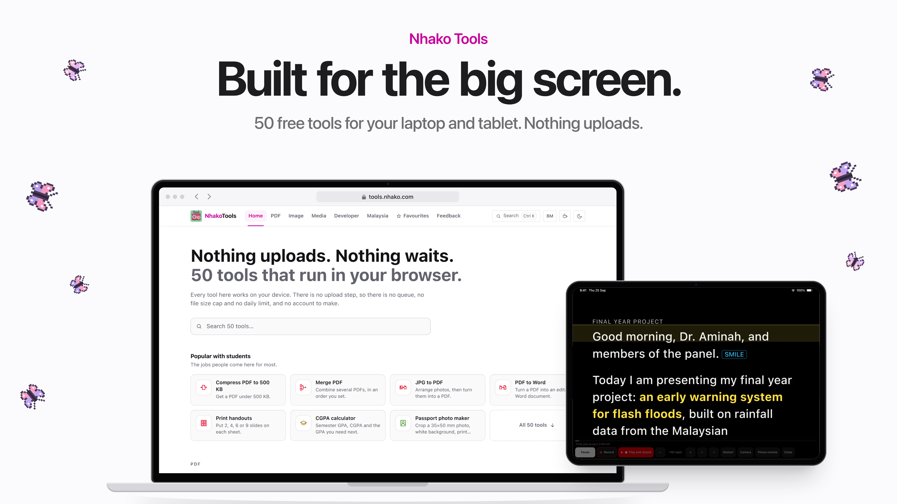

# The launch film and posters

`launch/nhako-tools-film.mp4`: 60 seconds, widescreen 1920 x 1080 at 30 fps,
H.264 + AAC stereo. For YouTube, X, LinkedIn, the site and a slide. Six
posters sit beside it in `launch/posters/`, and the README banner is part of
the same set.

The phone film ([launch-video.md](launch-video.md)) showed Nhako Tools on an
iPhone. This one shows what it is built for: **a laptop and a tablet**. It
features the tools students and Malaysians come for: the teleprompter, the
Malaysian salary calculator, the Malaysia collection, the CGPA planner, and
search that understands Malay.



## Style

The same keynote look as the phone film, which Kim approved: SF Pro Display,
headlines that rise word by word out of a blur, a small pink eyebrow
(`--pink-600`, `#c7009b`), grey sublines, a flat off-white stage (`#fbfbfd`),
no gradient colours and no pixel type.

- **Devices.** A laptop seen from the front (a graphite lid with a thin light
  rim, black bezel, silver base, a browser bar reading `tools.nhako.com`) and a
  tablet in landscape (graphite band, even bezel, a status bar reading
  "9:41 Thu 25 Sep"). They are drawn in CSS and carry no brand name.
- **Motion.** The laptop rises from below and its lid tilts up as it lands.
  Devices ease between poses in `timeline.mjs`. Push-ins land a detail
  at the centre of the frame, and a veil in the stage colour keeps the
  headline clear. The laptop is driven by a macOS pointer, the tablet by a
  finger.
- **The NeraOS hint.** The site's own pixel butterflies (`src/lib/butterfly.ts`,
  its four colourways), small and sharp, flying in the air beside the devices.
  Two large, out-of-focus ones drift across a bottom corner, in the opening
  only, when no device is on stage. Three circle the icon on the end card.

## The rule: no butterfly on a screen

Kim's brief was that the butterflies must not overlap a screen. The code
enforces this three ways:

1. **By design.** Each butterfly wanders in a patch of air beside the devices.
   The patch is worked out on every frame from where the devices actually are
   (their drawn boxes, read from the page after they are posed, with 40 px to
   spare). When a device grows or slides in, the patch shrinks and the
   butterfly is moved aside, or out of frame. In a full push-in the
   butterflies simply leave.
2. **By a guard.** After placing them, the scene measures every butterfly
   against every screen and hides any that would touch one, logging it in
   `window.__guard`.
3. **By a check that must pass.** `launch/film/check.mjs` renders every frame
   of the film and every poster. For each one it reads the boxes of the
   butterflies and screens straight from the page, and fails on any overlap
   **and** on any guard firing, so a butterfly blinking out cannot slip
   through either.

Last run (2026-09-25): 1,800 of 1,800 frames and 6 of 6 posters, no overlaps
and no guard firings. The closest a butterfly comes to a screen is 62.7 px in
the film and 20 px on a poster (the story poster).

## Storyboard

Times in seconds, 120 BPM (a bar is 2 s). The picture and the sound read the
same cue list, `launch/film/timeline.mjs`.

| Time | Picture | Words |
|---|---|---|
| 0 to 4 | Plain stage, butterflies, two lines rise out of a blur | **50 tools.** / **Zero uploads.** (pink) |
| 4 to 8.6 | The laptop rises, its lid tilts up, the screen wakes on the home page | Nhako Tools / **Built for the big screen.** / Your laptop. Your tablet. Right in the browser. |
| 8.6 to 13.4 | A scroll through all 50 tools and back | Home / **50 tools. One tab.** |
| 13.4 to 17.2 | The pointer clicks Search; push-in on the palette with "gaji" typed; click the result | Search / **Type it in Malay. Found.** / "Gaji" finds the salary calculator. |
| 17.2 to 22 | The salary calculator slides in; push-in on RM 4,706.00 | Made for Malaysia / **Your real take-home pay.** |
| 22 to 25.8 | The Malaysia collection | Malaysia / **Sized for every portal.** |
| 25.8 to 30 | The laptop leaves, the tablet slides in: the teleprompter with a final-year presentation; a tap on Start | Teleprompter / **Your script. On your tablet.** |
| 30 to 35.4 | Tap Play: the words scroll at the real 140 wpm | Teleprompter / **Read it. Record it.** |
| 35.4 to 40 | The CGPA calculator; push-in on the results and the plan | For students / **Know the GPA you need.** |
| 40 to 43 | Laptop and tablet side by side, both in Bahasa Melayu | Bahasa Melayu / **English. Or Malay.** |
| 43 to 46.6 | The stage goes black, both in dark mode; the music breaks down | Dark mode / **Light. Or dark.** |
| 46.6 to 51 | Both light again (laptop home, tablet on the Malaysia page), then they sink away | Private by design / **Nothing leaves your device.** |
| 51 to 60 | The icon, **Nhako Tools**, "Nothing uploads. Nothing waits.", the `tools.nhako.com` pill, "Free. No account. 50 tools, for your laptop and tablet." | |

## The posters

All of them are rendered at 2x, from `launch/film/posters.js`, with the same
devices, captures and butterflies. Sizes are in `posters.config.mjs`.

| File | Size | For | Headline |
|---|---|---|---|
| `hero.png` | 3840 x 2160, 16:9 | X, YouTube, LinkedIn, a slide | Built for the big screen. |
| `teleprompter.png` | 2160 x 2700, 4:5 | Instagram feed | Read it. Record it. |
| `malaysia.png` | 2160 x 2700, 4:5 | Instagram feed | Your real take-home pay. |
| `students.png` | 2160 x 2700, 4:5 | Instagram feed | Every semester job. One site. |
| `story.png` | 2160 x 3840, 9:16 | Stories, TikTok cover | Built for the big screen. |
| `docs/brand/banner.png` | 2560 x 1120 | README | Nhako Tools, Built for the big screen. |

## Where every claim comes from

Nothing on a screen is mocked up, and every number is one the app printed
during the capture (`launch/film/shots/meta.json`).

| Claim | Source |
|---|---|
| 50 tools | `src/tools/registry.ts`, and the site's own "Search 50 tools" |
| "Gaji" finds the salary calculator | The capture types `gaji` into the real palette. `gaji` is one of the calculator's keywords in the registry |
| RM 4,706.00 take-home | LHDN's worked example (RM 5,500, spouse working, three children), asserted in `e2e/malaysia.spec.ts`. The capture read "RM 4,706.00" back from the page |
| EPF, SOCSO, EIS and PCB, from the 2026 tables | The calculator's registry entry and its dated source files |
| SPA, UPU, JPJ and LHDN limits | The Malaysia collection (`src/tools/collections.ts`): passport, JPJ and SPM or UPU photo presets, the 500 KB ceiling on SSM, LHDN, JPA and UPU portals, the SPA MyRésumé preset |
| Import a .docx, words per minute, takes stay on the tablet | The teleprompter's own description and limits in the registry |
| 140 wpm scroll | The capture's stats line ("138 words, about 0:59 at 140 wpm"). The film scrolls the words layer at 138 words over its measured height, at 140 wpm |
| A 3.62 next semester lifts a 3.47 CGPA to 3.50 | The CGPA capture: 3.42 over 64 credits, then this semester's four courses (4 A, 3 A-, 3 B+, 2 A) on Universiti Malaya's scale. The app printed GPA 3.75, CGPA 3.47, "You need a GPA of 3.62 next semester". Checked by hand: (3.42 x 64 + 45.0) / 76 = 3.47, and (3.50 x 94 - 263.88) / 18 = 3.62 |
| Every page in English and Malay | The `/ms` pages |
| No upload, no account, no daily limit | The README's "Privacy, precisely" |

The presentation script on the teleprompter ("an early warning system for
flash floods") is a made-up example of what a student would read. It is
text in the tool, not a claim about the product.

## The soundtrack

The phone film's generator, `launch/video/audio.mjs`, pointed at this
timeline: `node launch/video/audio.mjs launch/film/timeline.mjs` writes
`launch/film/out/soundtrack.wav`. It is the same original synth score (no
samples, safe to post anywhere), with this film's cues: a whoosh as the laptop
rises, a click on every pointer click and tap, swishes on page changes, a
shimmer on the take-home number, a chime on the CGPA result, the breakdown for
dark mode, and a held C major chord on the end card. Measured with ffmpeg
`ebur128`: -13.7 LUFS integrated, -1.0 dBFS peak.

## Rebuilding it

Needs Node 22, Playwright's Chromium, SF Pro installed locally, and ffmpeg
with libx264.

```bash
npm run build
```

```bash
PORT=4400 npm run preview
```

Then, in a second terminal:

```bash
npm run launch:film
```

That runs, in order: `capture.mjs` (the laptop and tablet screens from the
preview, into the git-ignored `launch/film/shots/`, plus `meta.json`), the
soundtrack, `check.mjs` (the butterfly rule; the chain stops if it fails),
the film, the posters and the banner. The film takes about two minutes to render.

| Command | Output |
|---|---|
| `node launch/film/render.mjs --stills` | Check frames in `launch/film/out/` |
| `node launch/film/render.mjs --stills 19.5,31` | Just those times |
| `node launch/film/render.mjs --serve` | A local URL: add `?play` to watch with sound, or `?t=19.5` for one frame. `posters.html?p=hero` for a poster |
| `node launch/film/render.mjs --posters hero,story` | Just those posters |
| `node launch/film/check.mjs --step 3` | A faster butterfly check, every third frame |

To change the story, edit `timeline.mjs` (captions, screens, pointer, taps,
poses). To change a poster, edit its entry in `posters.js`; its butterflies
are `[x, y, scale, colour, degrees]`, and `render.mjs` reports any that
touches a screen.
