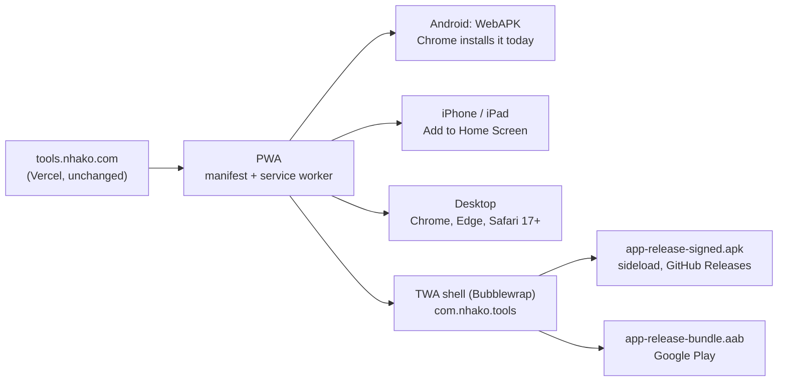

# Nhako Tools as a PWA and an Android APK

A plan, written 2026-09-25. Nothing in it is built yet. Every claim about the
current code was checked against the repo on that date; claims about Google's
platforms are marked with where they come from, and anything not yet tried on a
device is listed under **Not verified** at the end.

## The short version

Nhako Tools is **already a PWA**, and on Android an installed PWA is already an
APK: when Chrome installs a site from a real HTTPS origin it mints a **WebAPK**,
a genuine Android package that shows in the launcher, the app drawer and
Settings > Apps. What the site does not have yet is a **distributable** APK: a
file you can put on Google Play, or hand to someone to sideload.

The plan is a **Trusted Web Activity (TWA)** built with Google's
[Bubblewrap](https://github.com/GoogleChromeLabs/bubblewrap) CLI. A TWA is a
small Android shell that opens tools.nhako.com full screen in the user's own
Chrome, with no browser bar once the domain proves it owns the app.

### Why a TWA and not a WebView app (Capacitor, Cordova)

| | TWA (Bubblewrap) | WebView wrapper (Capacitor) |
|---|---|---|
| Engine | The user's Chrome: same as the website | Android System WebView |
| `SharedArrayBuffer` for ffmpeg.wasm (needs COOP/COEP) | Same behaviour as Chrome | Has to be re-tested; a WebView is not a browser tab |
| Service worker, OPFS (teleprompter takes), camera, file picker, downloads | Chrome's, already tested by the e2e suite | Each needs its own check, some need native plugins |
| Updates | Every Vercel deploy, instantly | Rebuild and resubmit, unless assets load remotely anyway |
| Code to maintain | A generated project and one config file | A second app |
| APK size | Small: the shell only | Bigger if the site is bundled into it |

The whole architecture of this site is "the browser does the work": 77 MB of
LibreOffice, ffmpeg, Whisper and ONNX run as WebAssembly in a real browser. A
TWA keeps that browser. A WebView wrapper swaps it for a different one and
re-opens every question the e2e suite has already answered.

## What exists today (verified in the repo)

| Piece | Where | State |
|---|---|---|
| Web app manifest | `public/manifest.webmanifest` | `id`, `start_url`, `scope`, `display: standalone`, `display_override`, `launch_handler`, 4 shortcuts, 2 narrow + 1 wide screenshot |
| Icons | `public/icons/` | 192/512 `any`, 192/512 `maskable` (the pixel toolbox on a lawn, sized for Android's 33.3% safe radius), `apple-touch-icon`, `favicon.ico` |
| Service worker | `scripts/build-sw.mjs` -> `dist/sw.js` | Precaches the app shell (8 files, 858 KB in the 2026-09-25 build); network-first navigation; vendor runtimes cache-first at versioned paths |
| Offline | same | Home works offline after one visit; a tool works offline once it has been opened |
| Install UI | `src/components/astro/InstallPrompt.astro` | `beforeinstallprompt` on Chrome/Edge/Android, Share-sheet steps on iOS, File > Add to Dock on Mac Safari; hidden when already standalone |
| Cross-origin isolation | `vercel.json`, `astro.config.mjs`, `scripts/preview.mjs` | COOP `same-origin` + COEP `require-corp` on every path |
| Tab bar app shell | `src/components/astro/TabBar.astro` | Below 1024 px the site already behaves like a native app |

Missing for the Android work: `/.well-known/assetlinks.json`, a `share_target`,
a way for the page to know it is running inside the TWA, and the Android project.

## Phase 0: PWA hardening (web only, no Android yet)

Small changes that make the PWA better everywhere and that the TWA inherits.

| # | Task | Why | Done when |
|---|---|---|---|
| 0.1 | Add `share_target` to the manifest, accepting PDFs and images by `POST multipart/form-data`, handled in `sw.js` and handed to the right tool | On Android, "Share > Nhako Tools" from Files, Gmail or WhatsApp becomes the fastest way into Compress PDF, Merge PDF, Compress image. Works for WebAPK and TWA alike | A PDF shared from the emulator's Files app opens in `/pdf/compress` with the file loaded, and nothing leaves the device (checked in the network log) |
| 0.2 | Add `file_handlers` for `.pdf`, `.jpg`, `.png`, `.heic` | "Open with Nhako Tools" on desktop Chrome and ChromeOS | Double-clicking a PDF in ChromeOS Files opens the installed app |
| 0.3 | Add a "you are offline" page to the navigation fallback for tools never opened | Today an unvisited tool page offline is the browser's error page | Airplane mode, tap an unvisited tool, see a Nhako page that says which tools are available |
| 0.4 | Add `e2e/pwa.spec.ts`: manifest parses, every icon URL resolves with the declared size, SW registers, shell is cached, `crossOriginIsolated === true` | Guards everything below | Runs green in Chromium and WebKit |
| 0.5 | Re-check installability in Chrome DevTools > Application > Manifest | Lighthouse 12 dropped its PWA category, so DevTools is the check now | No warnings listed |

## Phase 1: the Android project (Bubblewrap)

**Tooling.** Kim's machine has the Android SDK at `~/Android/Sdk` (platform
35, a `Medium_Phone_API_35` emulator, adb 1.0.41) and OpenJDK 21. It has no
`build-tools` yet; Bubblewrap offers to download its own JDK and Android
command-line tools on first run (per the Chrome for Developers quick start).

| # | Task | Detail |
|---|---|---|
| 1.1 | `npm i -g @bubblewrap/cli` (1.25.0 on npm on 2026-09-25) | Or `npx @bubblewrap/cli` to keep it out of the global tree |
| 1.2 | `bubblewrap init --manifest=https://tools.nhako.com/manifest.webmanifest` in a new `android/` folder | Reads name, colours, icons and shortcuts from the live manifest |
| 1.3 | Answer the prompts: package id `com.nhako.tools`, app name "Nhako Tools", launcher name "Nhako", start URL `/?source=twa`, status bar colour `#ffffff`, navigation bar colour `#ffffff`, splash background `#ffffff`, orientation `default` | `?source=twa` is how the page knows it is inside the app (Phase 2) |
| 1.4 | Create the upload keystore when Bubblewrap asks | **Kim holds the keystore file and both passwords.** Losing them means a new package id. Store them in a password manager, never in the repo |
| 1.5 | Enable "Fallback to Custom Tabs" and set `enableNotifications: false` in `twa-manifest.json` | The site sends no notifications; asking for the permission would be noise |
| 1.6 | `bubblewrap build` | Produces `app-release-signed.apk` (sideload) and `app-release-bundle.aab` (Play) |
| 1.7 | Add `/.well-known/assetlinks.json` to `public/`, generated by `bubblewrap fingerprint generateAssetLinks` | Without it the app opens as a Custom Tab with a URL bar, not full screen. Needs the SHA-256 of **both** the upload key and, once on Play, the Play App Signing key (Play Console > App integrity) |
| 1.8 | `vercel.json`: serve `/.well-known/assetlinks.json` as `application/json`, no redirect | Android fetches it directly; a redirect or HTML 404 fails verification |
| 1.9 | Add `android/` to the repo **without** the keystore: `.gitignore` gets `android/*.keystore`, `android/app/build/` | The Android project is regenerable from `twa-manifest.json` |

## Phase 2: behaviour inside the app

| # | Task | Why |
|---|---|---|
| 2.1 | Read `?source=twa` on first load, keep it in `sessionStorage`, set `data-app="android"` on `<html>` | One switch for the few things that differ |
| 2.2 | Hide the install card and the "Install" rows in the More sheet inside the app | Already true in `display-mode: standalone` (checked in `InstallPrompt.astro`), but assert it in a test |
| 2.3 | Decide what the Buy Me a Coffee button does inside the Play build | See **Decisions for Kim** |
| 2.4 | Make every download land in Android's Downloads with the right name | Chrome handles `<a download>` in a TWA; verify each output type (PDF, ZIP, DOCX, PPTX, JPG, MP3, WebM) |
| 2.5 | Teleprompter camera and microphone permission prompts | They come from Chrome, which is expected; check the wording once on a device |
| 2.6 | Back button | Android's back gesture should walk the site's history, and leave the app from Home |

## Phase 3: test on the emulator and one real phone

The emulator recipe from the app-shell pass still applies:
`adb forward tcp:9222 localabstract:chrome_devtools_remote`, then Playwright
`connectOverCDP`. Against the **deployed** site this time: localhost cannot
verify Digital Asset Links, so the TWA would fall back to a Custom Tab.

Acceptance, each one run and recorded, not assumed:

1. Opens full screen, no URL bar (asset links verified).
2. `crossOriginIsolated` is `true`; Compress video and Extract audio finish (ffmpeg.wasm).
3. Merge PDF, Compress PDF, Scan to PDF (camera), OCR PDF, Remove background finish, and the output downloads.
4. A teleprompter take records, survives an app restart (OPFS), and downloads.
5. Share a PDF from Files into the app (Phase 0.1).
6. Airplane mode: Home and a previously opened tool still work.
7. Back button, rotation, split screen, dark mode toggle.
8. `adb shell pm list packages | grep nhako` shows one package, not a WebAPK **and** a TWA both installed; if a user has both, they are separate apps and both keep their own storage (see Not verified).

## Phase 4: distribution

**Sideload first** (no account needed): attach `app-release-signed.apk` to a
GitHub Release and link it from `/about`. Android asks the user to allow
"install unknown apps" for their browser, which is a real barrier; it suits
testers, not the public.

**Google Play** (Kim's account, Kim's actions):

1. Create a Google Play developer account (one-time registration fee; identity verification).
2. Create the app, upload the `.aab` to **closed testing**.
3. For a personal account created recently, Google requires "a minimum of 12 testers who have been opted in continuously for at least 14 days" before production access ([Play Console Help](https://support.google.com/googleplay/android-developer/answer/14151465), read 2026-09-25). The student audience from the feedback page is the natural pool.
4. Store listing: reuse `public/screenshots/`, the launch video (`launch/nhako-tools-launch.mp4`), and the 512 icon. The listing's privacy answers are short and true: no data collected by the app; Vercel Web Analytics counts page views without cookies.
5. Content rating questionnaire, target audience (13+ keeps it simple), data safety form.
6. After 14 days, apply for production.

**Updates.** Web changes ship through Vercel as today, no store review. The APK
only changes when the shell does (new icon, colours, shortcuts, share target):
bump `appVersionCode` in `twa-manifest.json`, `bubblewrap build`, upload.

## Phase 5 (optional): CI

A GitHub Action on tags `android-v*` that runs `bubblewrap build` with the
keystore from repository secrets and attaches the APK to the release. Only
worth it once releases are regular; by hand is fine at first.

## iPhone and iPad

No APK equivalent, and none planned. iOS installs the PWA through Share > Add
to Home Screen, which the install card already walks through. An App Store
wrapper around a website risks rejection under Apple's minimum-functionality
guideline and would run in WKWebView, not Safari; not recommended.

## Decisions for Kim

1. **Package id.** `com.nhako.tools` is proposed. It is permanent once on Play.
2. **Coffee button in the Play build.** Keep it as an external link, or hide it
   when `data-app="android"`. Play's payments policy has rules on links to
   outside payment for digital goods; whether a tip jar counts was **not
   checked**. Hiding it in the app is the safe default until it is.
3. **Keystore custody.** Who holds it, and where the backup lives.
4. **Play at all, or sideload only.** Play means the 12-tester, 14-day step
   and a yearly-ish round of policy forms; sideload means almost nobody installs it.

## Not verified

- That `SharedArrayBuffer` and ffmpeg.wasm work inside a TWA exactly as in
  Chrome. Expected, because a TWA is Chrome, but not yet run.
- The final APK and AAB sizes.
- Whether a user who installed the WebAPK and later the Play TWA gets two
  launcher icons, and whether their favourites and teleprompter takes carry
  over (both are the same origin in the same Chrome profile, so they should).
- Share target handling of very large files (hundreds of MB) through the
  service worker.
- Play policy on the Buy Me a Coffee link (Decision 2).
